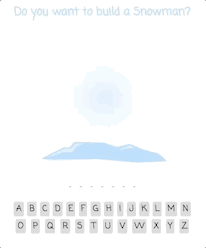

## Summary

In this assignment we were instructed to build a "Snowman" version of the popular game, Hangman.

## Things Learned

- Reinforced my knowledge in HTML, CSS, Javascript, and React
- Learned what a guard clause is and how to implement it
- Manipulating data in a JSON file

## Technologies Used

- Javascript - https://www.javascript.com/
- REACT - https://reactjs.org/
- CSS
- HTML
